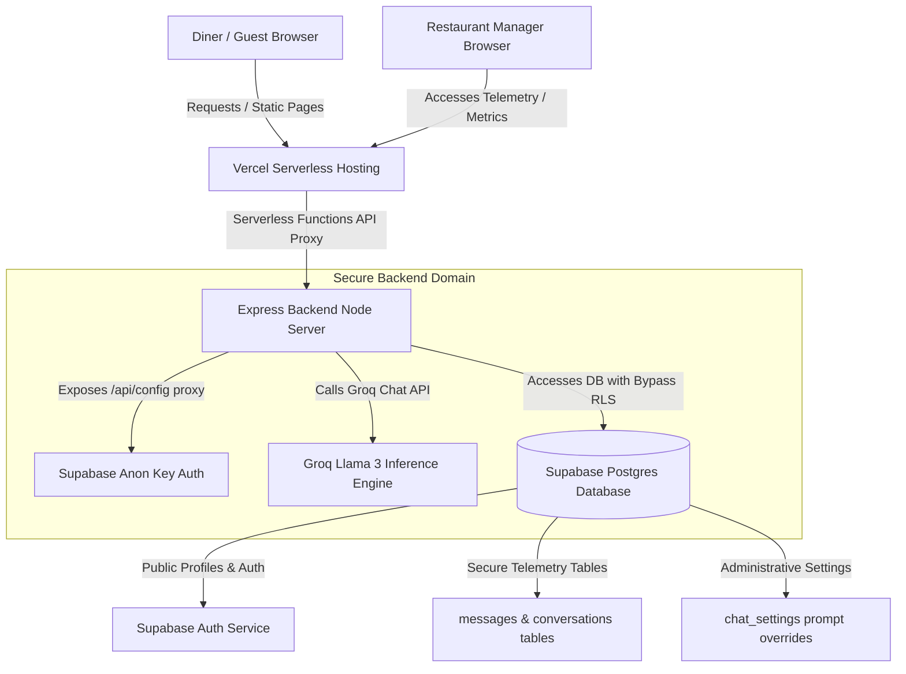

# 🌊 Kolachi Restaurant — Beach Avenue Guest Portal & Operations Console

A high-fidelity, premium, full-stack web application custom-engineered for the legendary **Kolachi Restaurant on Clifton Beach (Phase VIII, DHA, Karachi, Pakistan)**. 

This application merges an ultra-immersive, glassmorphic public dining portal with an intelligent **AI Dining Host** (powered by Groq Llama 3) and a robust **Operations Control Dashboard** designed for managers to inspect telemetry, adjust database parameters, configure chatbot guardrails, and audit diner chat transcripts.

---

## 📐 System Architecture & Flow



### 🔒 Secure Proxy Architecture
To prevent credential exposure and maintain absolute security:
1. **No Frontend Hardcoding**: The frontend client never has direct access to private tokens or Groq keys. 
2. **Configuration Service Proxy**: A secure endpoint `/api/config` dynamically feeds public-facing Supabase URLs and anonymous keys to `app.js` upon initialization.
3. **Bypass RLS Telemetry**: The administrative operations (e.g., loading historical message streams, listing restaurant profiles) are secured behind path authorization (`adminEmail` verification) and executed server-side via the `SUPABASE_SERVICE_ROLE_KEY` client to bypass Row Level Security rules cleanly without database leaking.

---

## ✨ Features & Visual Aesthetics

### 1. Gastronomic Visual Portal (`index.html`)
- **Seaside Styling**: Custom-tuned dark-theme background sweeps, dynamic glassmorphic card widgets, ambient neon light filters, and a bespoke Satoshi & Clash Display typography.
- **Scroll Scatter Engine**: Dynamic scroll combining effect where signature dishes and elements organically fly in from offset positions and merge with custom cubic-bezier timing.
- **Micro-Animated Navbar**: Sliding mobile navigation drawer that unfolds with custom staggering delay animations on children links and interactive CTAs.

### 2. Intelligent AI Guest Workspace (`chat.html`)
- **Groq Llama 3 Inference**: Provides instantaneous responses regarding oceanfront deck seating reservation times, menu pricing, directions, and ingredients.
- **Strict Prompt Guardrails**: Low-temperature inference (`temperature: 0.1`) paired with database-backed custom instructions. The AI acts exclusively as an ambassador for Kolachi and politely rejects unrelated off-topic queries.
- **Diner Rate Limiter**: Restricts non-admin profiles to 10 chat messages per hour, displaying a floating visual clock and countdown timer above the chatbox. Admin profiles (`zaidali332311@gmail.com`) automatically bypass all rate limiting.
- **Conversational Thread Deletion**: Diners can delete their historical conversations directly from the sidebar. Foreign key cascades cleanly delete associated chat transcripts instantly.

### 3. Mission Operations Control Dashboard (`admin.html`)
- **Instructions Customizer**: Live text prompt box allowing administrators to rewrite the AI system prompt dynamically, immediately overriding Groq inference rules without redeploying code.
- **System Metrics & Telemetry**: Evaluates registered guest numbers, global message counts, and guardrail refusal rates in real-time.
- **Administrative Transcripts Audit**: Inspects the latest 150 customer messages with email associations.
- **Aspect-Ratio Secured Analytics**: Features dynamic responsive charts representing peak hourly system usage using Chart.js.

---

## 🛠️ Technology Stack

- **Frontend Core**: Vanilla HTML5, Satoshi & Clash Display custom typography, Material Symbols icons library.
- **Styles CSS**: Premium Vanilla CSS3 (Custom variables, glassmorphic panels, flex/grid systems, animated topbars).
- **Backend Environment**: Node.js & Express.js.
- **Inference Engine**: Groq Node SDK (defaulting to the lightning-fast `llama-3.3-70b-versatile` model).
- **Database Backend & Auth**: Supabase JS Client (Auth, Profiles table sync, Telemetry logging).
- **Serverless Hosting**: Vercel Serverless Functions (`@vercel/node` builder support).

---

## 📁 Repository Structure
```text
neuralchat/
├── .env.template           # Template for local environment parameters
├── .gitignore              # Ignores .env, node_modules, and root screens/diagnostic assets
├── README.md               # Master-level system documentation
├── package.json            # Script definitions and Express dependencies
├── package-lock.json       # Exact node dependency lockfile
├── server.js               # Secure Express backend and Serverless entry point
├── vercel.json             # Vercel deployment router configuration
└── public/                 # Immutable frontend assets
    ├── index.html          # Scenic Landing Homepage
    ├── login.html          # Glassmorphic Diner Sign In
    ├── signup.html         # Premium Diner Register page
    ├── forgot-password.html# Supabase auth password resets
    ├── chat.html           # Guest AI Conversation panel
    ├── history.html        # Diner historical chat rosters
    ├── settings.html       # Diner security settings and user configurations
    ├── admin.html          # Operational analytics, statistics & prompts override
    ├── admin-users.html    # User telemetry roster
    ├── admin-analytics.html# Interactive metrics graphs and peak hours charts
    ├── app.js              # Centralized responsive controllers and Supabase Client initialization
    ├── privacy.html        # Restaurant privacy terms
    └── terms.html          # Restaurant dining rules and policies
```

---

## 💾 Database Schema Setup (Supabase)

To bootstrap your database, execute the following SQL scripts in the **SQL Editor** of your Supabase dashboard:

```sql
-- 1. Create a Profiles table to store user metadata and roles
CREATE TABLE public.profiles (
  id UUID REFERENCES auth.users ON DELETE CASCADE PRIMARY KEY,
  email TEXT UNIQUE NOT NULL,
  role TEXT DEFAULT 'user' NOT NULL,
  created_at TIMESTAMP WITH TIME ZONE DEFAULT timezone('utc'::text, now()) NOT NULL
);

-- Enable RLS on Profiles
ALTER TABLE public.profiles ENABLE ROW LEVEL SECURITY;

CREATE POLICY "Users can view their own profile" 
ON public.profiles FOR SELECT USING (auth.uid() = id);

-- 2. Create a Conversations table for chat logs
CREATE TABLE public.conversations (
  id UUID DEFAULT gen_random_uuid() PRIMARY KEY,
  user_id UUID REFERENCES auth.users ON DELETE CASCADE NOT NULL,
  title TEXT DEFAULT 'New Dining Session' NOT NULL,
  model TEXT NOT NULL,
  created_at TIMESTAMP WITH TIME ZONE DEFAULT timezone('utc'::text, now()) NOT NULL,
  updated_at TIMESTAMP WITH TIME ZONE DEFAULT timezone('utc'::text, now()) NOT NULL
);

-- Enable RLS on Conversations
ALTER TABLE public.conversations ENABLE ROW LEVEL SECURITY;

CREATE POLICY "Users can manage their own conversations" 
ON public.conversations FOR ALL USING (auth.uid() = user_id);

-- 3. Create a Messages table to log individual dialogue entries
CREATE TABLE public.messages (
  id UUID DEFAULT gen_random_uuid() PRIMARY KEY,
  conversation_id UUID REFERENCES public.conversations ON DELETE CASCADE NOT NULL,
  role TEXT CHECK (role IN ('user', 'assistant')) NOT NULL,
  content TEXT NOT NULL,
  created_at TIMESTAMP WITH TIME ZONE DEFAULT timezone('utc'::text, now()) NOT NULL
);

-- Enable RLS on Messages
ALTER TABLE public.messages ENABLE ROW LEVEL SECURITY;

CREATE POLICY "Users can view messages in their conversations" 
ON public.messages FOR SELECT 
USING (
  EXISTS (
    SELECT 1 FROM public.conversations 
    WHERE conversations.id = messages.conversation_id AND conversations.user_id = auth.uid()
  )
);

CREATE POLICY "Users can insert messages in their conversations" 
ON public.messages FOR INSERT 
WITH CHECK (
  EXISTS (
    SELECT 1 FROM public.conversations 
    WHERE conversations.id = conversation_id AND conversations.user_id = auth.uid()
  )
);

-- 4. Create an Settings table to hold customizable AI instructions
CREATE TABLE public.chat_settings (
  id BIGINT PRIMARY KEY DEFAULT 1,
  instructions TEXT NOT NULL,
  updated_at TIMESTAMP WITH TIME ZONE DEFAULT timezone('utc'::text, now()) NOT NULL
);

-- Seed initial instructions
INSERT INTO public.chat_settings (id, instructions) 
VALUES (1, 'You are a professional AI chatbot for Kolachi Restaurant on Clifton Beach, DHA Karachi. Only answer questions regarding reservations, menu items, and seating policies. For unrelated topics reply politely that you are only authorized to assist with Kolachi Restaurant.')
ON CONFLICT (id) DO NOTHING;

-- 5. Trigger profile creation on Auth Sign Up
CREATE OR REPLACE FUNCTION public.handle_new_user()
RETURNS TRIGGER AS $$
BEGIN
  INSERT INTO public.profiles (id, email, role)
  VALUES (new.id, new.email, 'user');
  RETURN NEW;
END;
$$ LANGUAGE plpgsql SECURITY DEFINER;

CREATE TRIGGER on_auth_user_created
  AFTER INSERT ON auth.users
  FOR EACH ROW EXECUTE PROCEDURE public.handle_new_user();
```

---

## 🔒 Security & Local Environment Setup

1. Clone your project code and navigate to the directory:
   ```bash
   cd neuralchat
   ```
2. Install npm dependencies:
   ```bash
   npm install
   ```
3. Create a `.env` file in the root folder using `.env.template` as a model:
   ```env
   PORT=3050
   NODE_ENV=development

   # Groq SDK API Access Key
   GROQ_API_KEY=gsk_your_live_groq_api_key_here

   # Supabase Client Credentials
   SUPABASE_URL=https://your-project-id.supabase.co
   SUPABASE_ANON_KEY=eyJhbGciOiJIUzI1NiIsInR5cCI6IkpXVCJ9.your_anon_key_here

   # Supabase Service Key (CRITICAL: Private to server, bypasses RLS for metrics logs)
   SUPABASE_SERVICE_ROLE_KEY=eyJhbGciOiJIUzI1NiIsInR5cCI6IkpXVCJ9.your_service_role_key_here
   ```

4. Launch the local web server:
   ```bash
   npm run dev
   ```
5. View in browser: [http://localhost:3050](http://localhost:3050)

---

## ☁️ Vercel Deployment Instructions

The project is fully structured for serverless deployment on **Vercel** via serverless wrappers!

1. Install the Vercel CLI (`npm install -g vercel`) or sign in on the [Vercel Dashboard](https://vercel.com).
2. Create a new project and import your repository.
3. Configure the following **Environment Variables** in your Vercel Dashboard Settings:
   - `GROQ_API_KEY` (Your actual Groq API credential)
   - `SUPABASE_URL` (Your Supabase endpoint)
   - `SUPABASE_ANON_KEY` (Your Supabase public anon key)
   - `SUPABASE_SERVICE_ROLE_KEY` (Your Supabase private administrative service key)
4. Trigger the deployment. Vercel will evaluate `vercel.json`, build `server.js` using the `@vercel/node` runtime, and automatically direct traffic to the scenic dining portal!

---

## 🚀 Clean GitHub Deployment Guidelines

To cleanly push the codebase to your GitHub repository (`https://github.com/zaidautomates/Support-bot`) without triggering Push Protection or rule issues:

### 1. Re-initialize & Commit
Since the old git commit contained Stitch mockup screens and images, we have deleted those folders locally and cleanly reset the branch references. Execute the following in Git Bash:
```bash
# Stage the active project files
git add .gitignore package.json package-lock.json server.js vercel.json README.md .env.template public/

# Make a fresh, clean Initial Commit
git commit -m "feat: initial commit - launch premium responsive Kolachi dining guest portal"
```

### 2. Handle Branch Protection Rules
If pushing directly to `main` is blocked by branch protection policies on your GitHub repository (e.g. `push declined due to repository rule violations`), you should:
- **Option A: Push to a development branch** (Recommended if main is protected):
  ```bash
  # Create a dev branch
  git checkout -b dev
  
  # Push dev branch to GitHub
  git push -u origin dev
  ```
  Once pushed to `dev`, open a **Pull Request** on GitHub from `dev` to `main` and merge it. This bypasses direct-push branch protection rules gracefully!

- **Option B: Adjust Repository Rules** (If you are the admin):
  Go to your repository settings page on GitHub (`https://github.com/zaidautomates/Support-bot/settings`), select **Rules or Branches**, and verify if there is a ruleset that restricts direct pushes to `main`. You can temporarily toggle it off or add your account to the "bypassed list" to push directly.

---

## 👥 Authors & Contributors

- **Zaid Ali** — Principal Engineer & Project Owner ([@zaidautomates](https://github.com/zaidautomates))
- **Antigravity AI** — Pair Programming Architect & Visual Specialist (Google DeepMind Team)

---

## 📄 License

This project is licensed under the **ISC License** — see the [package.json](file:///e:/Automation/New%20folder%20(2)/neuralchat/package.json) file for details.

---

## 🌟 Support & Acknowledgments

- **Special Thanks**: Dedicated to the culinary masters and welcoming hosts at **Kolachi Restaurant on Clifton Beach, Karachi** for inspiring this premium digital guest experience.
- **Inquiries**: For programmatic integration support, custom AI agent deployments, or seaside table reservations, reach out via the official channels at `reservations@kolachi.pk` or call `+92-21-111-111-001`.

