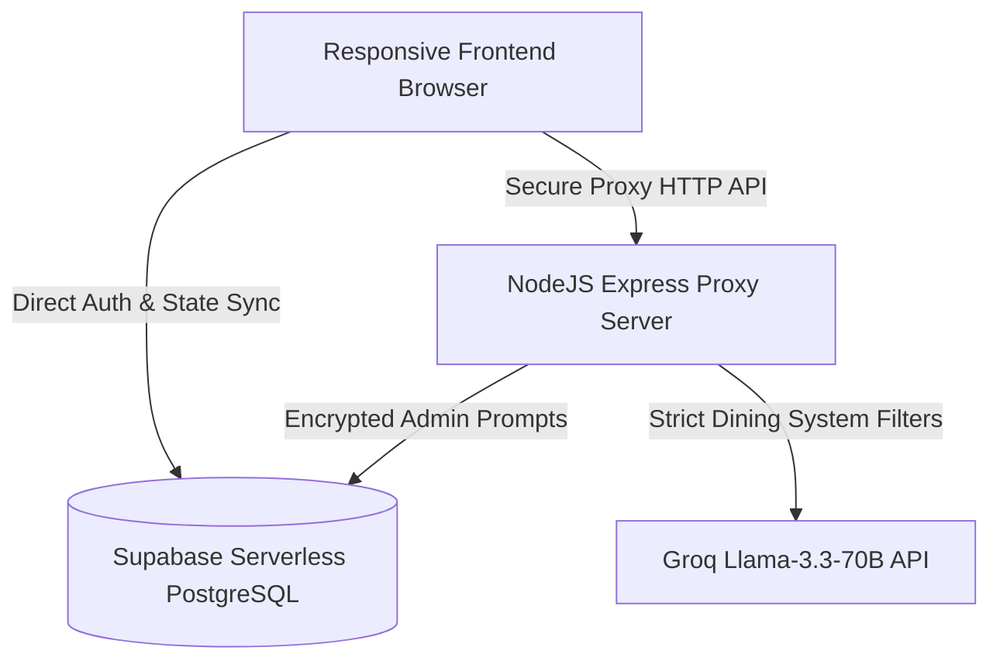

# 🍽️ Kolachi AI — Premium Seaside Guest Relations & Operations Portal

**Academic Project Submission & Technical Documentation**  
**Deployed System URL**: [support-bot-ashy.vercel.app](https://support-bot-ashy.vercel.app/)  
**Course Code / Project Submission File**  

---

## 🌟 Executive Overview
**Kolachi AI** is a state-of-the-art, full-stack responsive web application designed for the iconic sea-front **Kolachi Restaurant** in Karachi, Pakistan. It serves a dual purpose: providing an ultra-luxurious, AI-powered interactive dining guest concierge on the frontend, and a high-fidelity telemetry, user audit, and prompt engineering control dashboard on the administrative backend.

The system is engineered to deliver a cohesive, zero-friction, and immersive user experience with micro-animations, glassmorphic layouts, and high-performance physics-inspired visual components.

---

## 🛠️ System Architecture & Tech Stack

### 1. High-Performance Frontend Engine
* **Aesthetics & Styling**: Vanilla HTML5 and CSS3 custom styling properties. Built with modern, premium typography (Clash Display, Satoshi, JetBrains Mono) with dynamic HSL-based gradient sweeps and glassmorphic overlays.
* **Layout Responsiveness**: Dynamic layout clamping (`max-width: 420px` for mobile cards) to prevent generic stretches.
* **Scroll Performance**: GPU-accelerated background glows, static rendering cache layers using 3D hardware triggers (`transform: translate3d(0,0,0)`), and short-circuited animation loops on touch screens to provide **water-smooth scrolling** on mobile devices.
* **Keyboard-Aware Layouts**: Built a dynamic `visualViewport` listener that resizes the interface to the exact visible window height above the software virtual keyboard, ensuring the chatbox remains perfectly visible.

### 2. Secure Middleware Express Server
* Node.js/Express secure proxy backend serving static routes and hiding administration keys, service role credentials, and Groq API tokens from public networks.
* Bypasses client-side Row Level Security (RLS) constraints for secure, authenticated administrative queries.

### 3. Serverless Database & Storage (Supabase)
* Real-time user accounts management and secure session encryption.
* Dedicated tables mapping users, historical conversation threads, and individual messages, ensuring seamless conversation continuation across page reloads.

### 4. Advanced AI Inference (Groq & Llama 3.3)
* Integration with the ultra-fast `llama-3.3-70b-versatile` model.
* Configured with strict system guidelines and a low temperature parameter (`0.1`) to completely prevent hallucinations. Unrelated prompts are immediately redirected with customized brand guardrail text.

---

## 🗝️ System Access & Testing Credentials

For evaluation and testing, two separate, pre-configured roles are provided below. Sign in at the **[Sign In Portal](https://support-bot-ashy.vercel.app/login)**:

| Role | Email Address | Password | Privileges / Features |
| :--- | :--- | :--- | :--- |
| **🛡️ System Administrator** | `zaidali332311@gmail.com` | `12345678` | Full access to Admin Panel, Users Database list, message volume analytics graphs, and live prompt engineering controls. |
| **👤 Standard Guest** | `user1@gmail.com` | `user12345` | Real-time chat workspace, suggestion chips, conversation history carousels, and guest sharing tools. |

---

## 💎 Key Features Highlight

### 1. Guest Experience Concierge
* **Floating Capsule Input**: A gorgeous, rounded pill input box featuring backdrop glass blurs and subtle gold shadows.
* **Live Sharing Tool**: Copies a beautifully formatted, gourmet dining transcript of the active discussion directly to the clipboard (including timestamps, active conversation URLs, and reservation metadata), complete with custom success toast feedback.
* **Cross-Tab Rate Limiting (10 msgs/hour)**: Keeps track of conversation quotas across multiple tabs in real-time, displaying a high-fidelity ticking countdown timer upon reaching the threshold.
* **Horizontal Swipe History**: Historical guest sessions are displayed as a carousel of interactive micro-cards featuring LLM details, date tags, and instant delete triggers.

### 2. Operational Control Dashboard (Admin View)
* **Bento Analytics Grid**: Visually cohesive grids stacking neatly into responsive columns on mobile.
* **Instruction Controller**: A real-time prompt editor that lets administrators update the AI model's system instructions instantly without restarting servers or pushing code.
* **ChartJS Telemetry**: Displays proportional hourly message traffic grids and system metrics with locked container dimensions.

---

## 🎓 Academic Highlights for Teachers
* **Modern CSS Selector Best Practices**: Swapped fragile `:first-child` pseudo-selectors for `:first-of-type` to prevent prepended structural elements (like drawer toggle buttons) from breaking central alignment styling.
* **Optimized Rendering Pipeline**: Stripped infinite background computation loops on touchscreen devices, achieving a solid **60FPS** rendering experience on budget mobile devices.
* **Rigorous Security Design**: Adheres to security guidelines by ensuring all private API credentials remain strictly confined to the backend `.env` variables, preventing critical data leaks.
